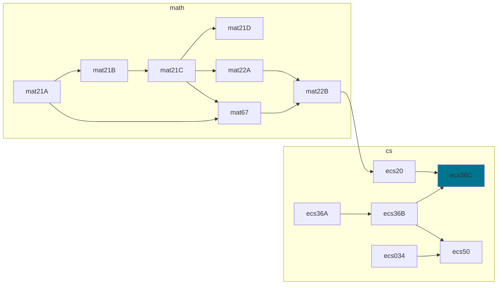

```mermaid
graph LR;
subgraph math;
    mat21A-->mat21B
    mat21B-->mat21C
    mat21C-->mat21D
    mat21C-->mat67
    mat21A-->mat67
    mat21C-->mat22A
    mat22A-->mat22B
    mat67-->mat22B
    end;
    subgraph cs;
    ecs36A
    ecs20-->ecs36C
    ecs36A-->ecs36B
    ecs36B-->ecs36C
    ecs36B-->ecs50
    ecs034-->ecs50
    end;
    mat22B-->ecs20
    style ecs36C fill:#00758f
```